# Procesverslag
**Auteur:** -Anoek Balemans-

Markdown cheat cheet: [Hulp bij het schrijven van Markdown](https://github.com/adam-p/markdown-here/wiki/Markdown-Cheatsheet). Nb. de standaardstructuur en de spartaanse opmaak zijn helemaal prima. Het gaat om de inhoud van je procesverslag. Besteedt de tijd voor pracht en praal aan je website.

## Bronnenlijst
1. -Appetit, B. (2020, 26 oktober). Bon Appétit Magazine: Recipes, Cooking, Entertaining, Restaurants. Geraadpleegd op 27 oktober 2020, van https://www.bonappetit.com -
2. - M. (2015). Gin and juice fizz [foto]. Geraadpleegd van https://almostmakesperfect.com/2015/06/30/gin-and-juice-fizz/ -
3. -WHERE TO EAT AND DRINK IN KANSAS CITY. (z.d.). [foto]. Geraadpleegd van https://thetasteedit.com/where-to-eat-and-drink-in-kansas-city/ -
4. - L. (z.d.). Date night mushroom fettuccine [foto]. Geraadpleegd van https://pinchofyum.com/mushroom-fettuccine -
5. - tubik.arts. (2019). Mexican Food Illustration [illustratie]. Geraadpleegd van https://dribbble.com/shots/8517286-Mexican-Food-Illustration?utm_source=pinterest&utm_campaign=pinterest_shot&utm_content=Mexican%20Food%20Illustration&utm_medium=Social_Share -
6. - Bon Appétit. (2020, 27 april). Sohla Makes Lamb & Scallion Dumplings | From the Home Kitchen | Bon Appétit. Geraadpleegd op 27 oktober 2020, van https://www.youtube.com/watch?v=kKzg4La4C3Q -
7. - Bon Appétit. (2018, 24 maart). Carla Makes BA’s Best Fettuccine Alfredo | From the Test Kitchen | Bon Appétit. Geraadpleegd op 27 oktober 2020, van https://www.youtube.com/watch?v=BB6ZCkvg39k -

## Eindgesprek (week 7/8)

-Van de hele site was het moeilijkst om te maken het menu, vooral doordat ik een extra menu in het menu heb gezet. Het extra menu bleef namelijk in beeld staan zelfs als het andere menu weg was, na heel veel manieren proberen met css en javascript werkt het menu nu zoals ik bedoel. Het was makkelijker om al de elementen op de goede plek te krijgen in het begin was het nog wel moeilijk, maar als je door hebt hoe het werkt kan het zelfs leuk worden. Ik was begonnen in de blauwe piste en denk dat ik wel naar de rode piste ben gegaan, ook al heb ik nog veel moeite met JavaScript en al de mogelijkheden die css heeft.  -

**Screenshot(s):**

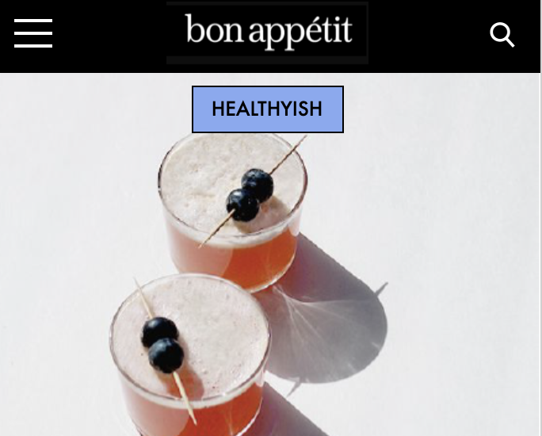 
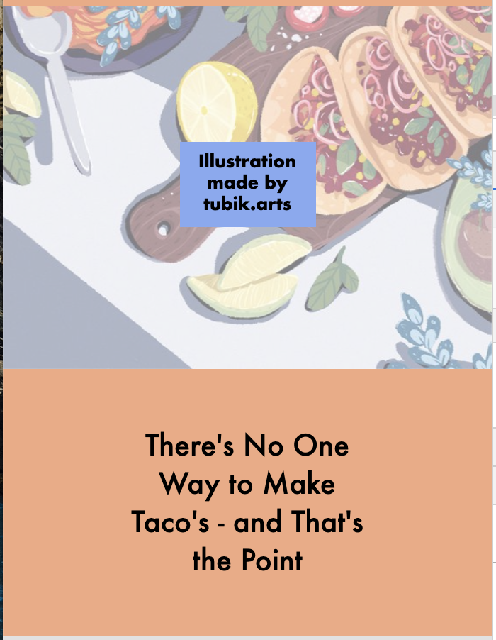 
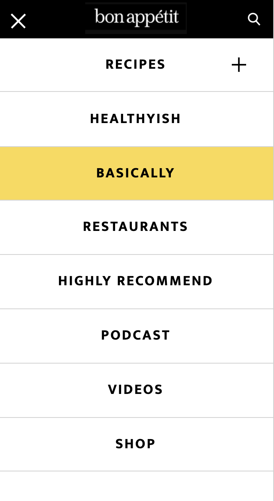 
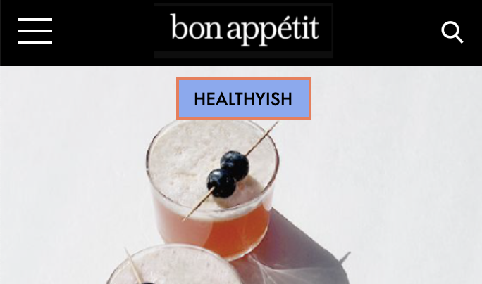 
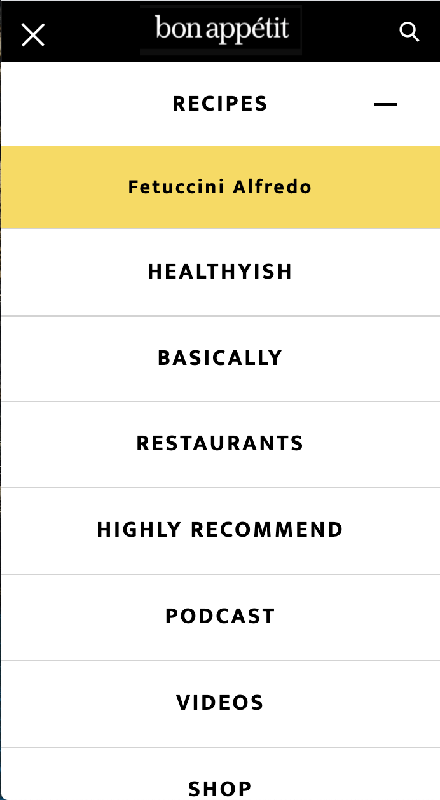 
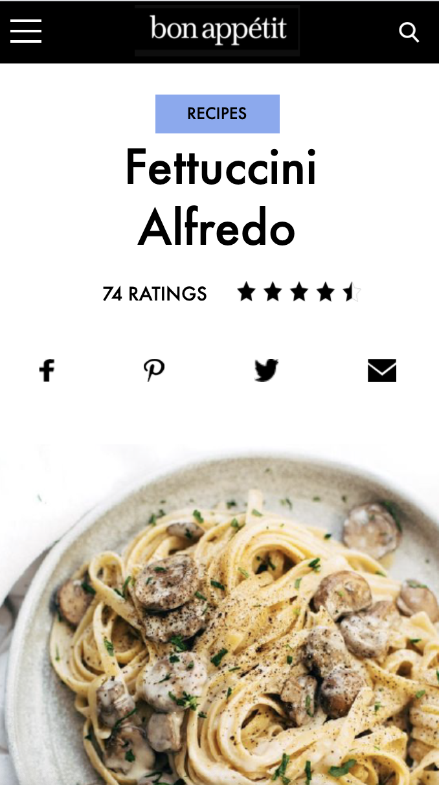 

## Voortgang 3 (week 6)

### Stand van zaken

-Nu ik beide pagina's af heb ben ik begonnen aan wat ik het moeilijkst vind, javascript. Ik wil uiteindelijk mijn hamburger menu gaan animeren, daarvoor moest ik eerst het menu maken met css in plaats van de img die ik eerder had. Daarna was ik begonnen met de werking van het gebasseerd op de opdrachten van Sanne, helaas kwam ik er hiermee niet uit. Na andere hulp en video's ben ik er naar wat uren wel uitgekomen en werkt het menu eindelijk. Er zijn daarentegen wel wat slachtoffers gevallen in opzichte van stijling.-

**Screenshot(s):**

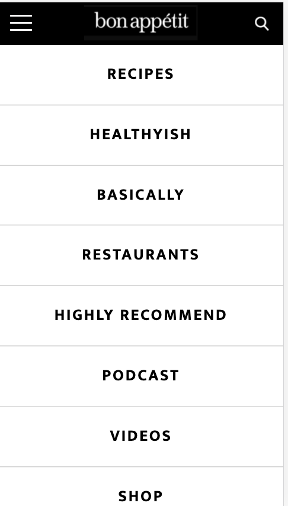 
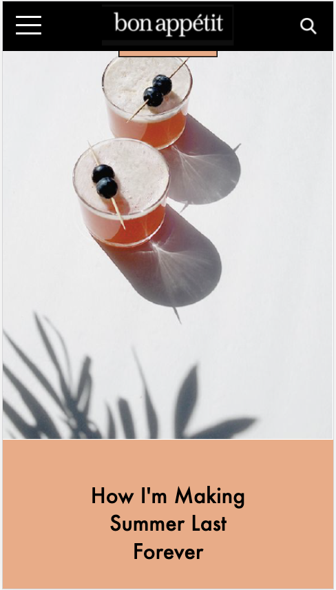 

### Agenda voor meeting

-omstebeurt site bespreken en vragen stellen.-

### Verslag van meeting

-na afloop snel uitkomsten vastleggen-

## Voortgang 2 (week 5)

### Stand van zaken

-Ben begonnen aan de tweede pagina, hiermee kwam ik al snel tegen een probleem. De elementen pakte steeds de eerste en de tweede stijling, ook al had de tweede body een class. Heb na wat rond vragen een oplossingen gevonden, door ook de eerste pagina een class te geven, hierdoor hebben de elementen niet meer de neiging om twee stijlingen te nemen. Verder heb ik in de tweede pagina meer gewerkt met text en het vormgeven, dat ging op zich best goed.-

**Screenshot(s):**

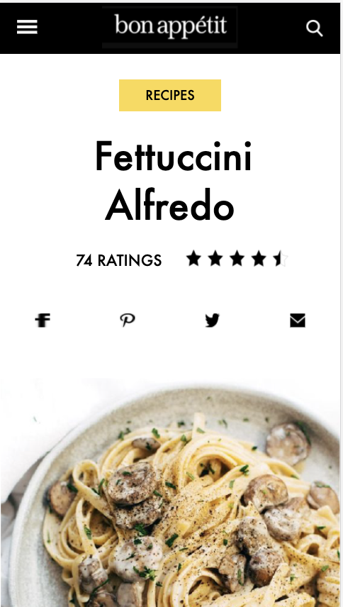 
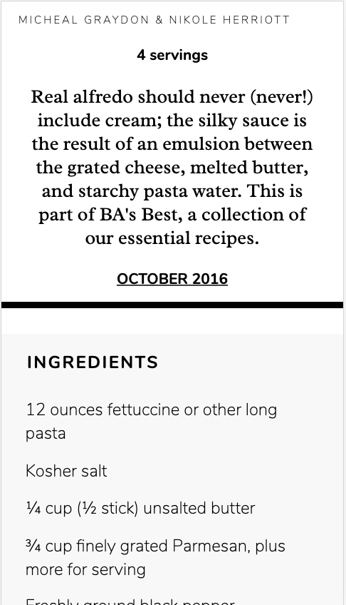 
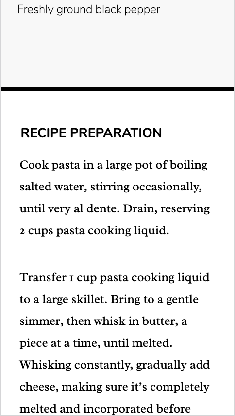 
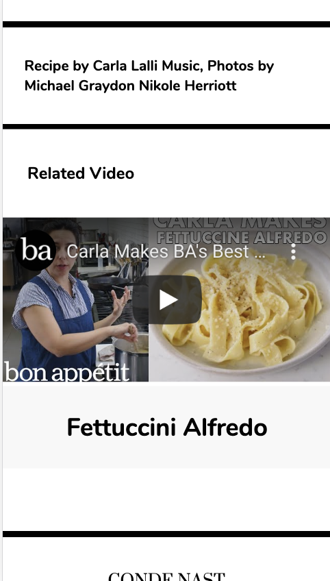 
 

### Agenda voor meeting

-omstebeurt site bespreken en vragen stellen.-

### Verslag van meeting

-na afloop snel uitkomsten vastleggen-

## Voortgang 1 (week 3)

### Stand van zaken

-Na even proberen ging het positioneren met flex goed. Mijn grootste probleem zit het in responsive maken, het ziet er wel goed uit in iphone 5/SE. De positie met em of % worden alsnog lelijk als ik het beeld groter maak. Het stijlen met nth-of-type kreeg ik soms niet voor elkaar, waardoor ik id's moest gebruikem.-

**Screenshot(s):**

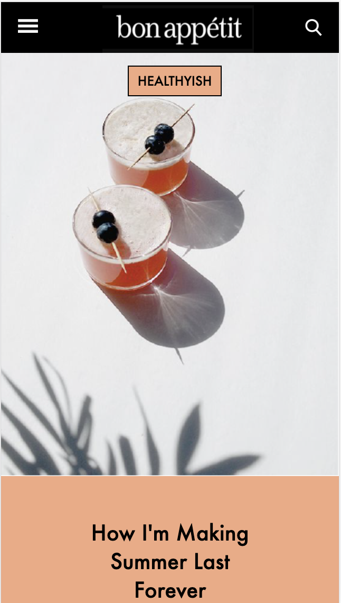 
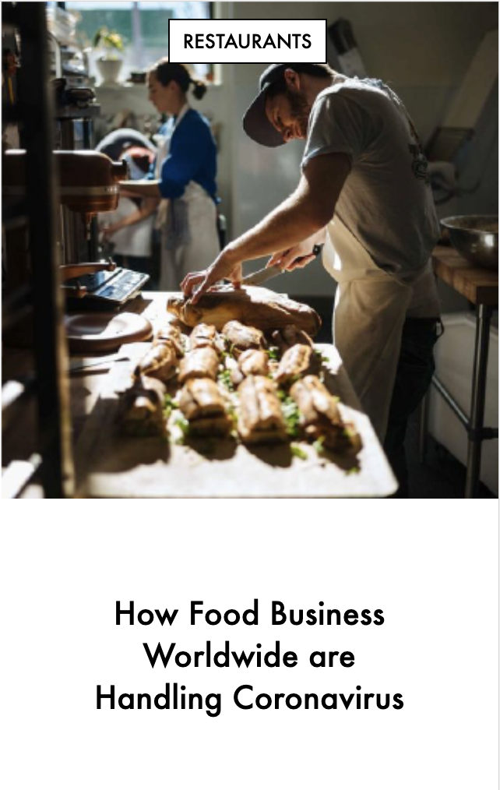 
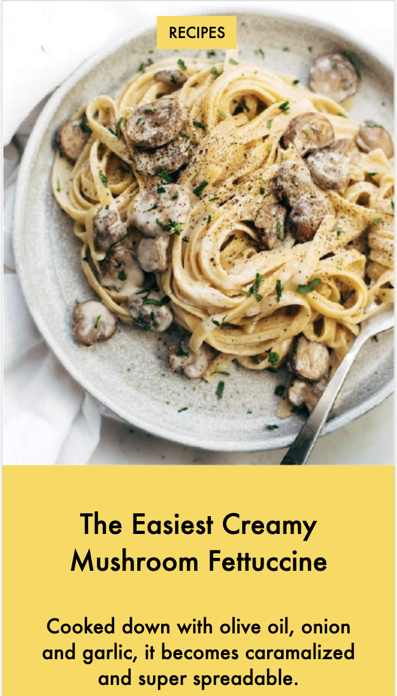 
 
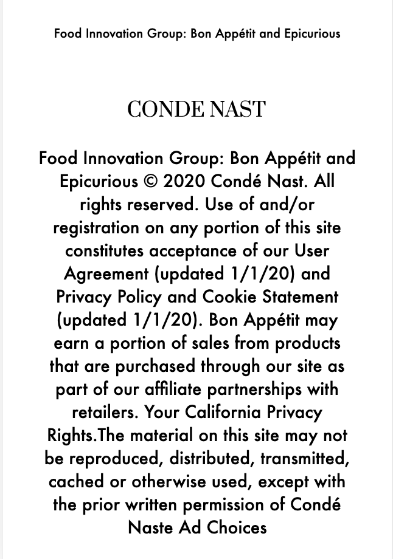 

### Agenda voor meeting

-omstebeurt site bespreken en vragen stellen, hoe je je site responsive kan maken?, hoe je een video toevoegd?, hoe een page snap mogelijk is? en algemen info over wat er verwacht word van de pagina's.-

### Verslag van meeting

-na afloop snel uitkomsten vastleggen-

## Intake (week 1)

**Je startniveau:** -blauw-

**Je focus:** -surface plane-

**Je opdracht:** -https://www.bonappetit.com - 
- Ik weet niet of de website te simpel is, omdat het vaak hetzelfde herhaald.

**Screenshot(s):**

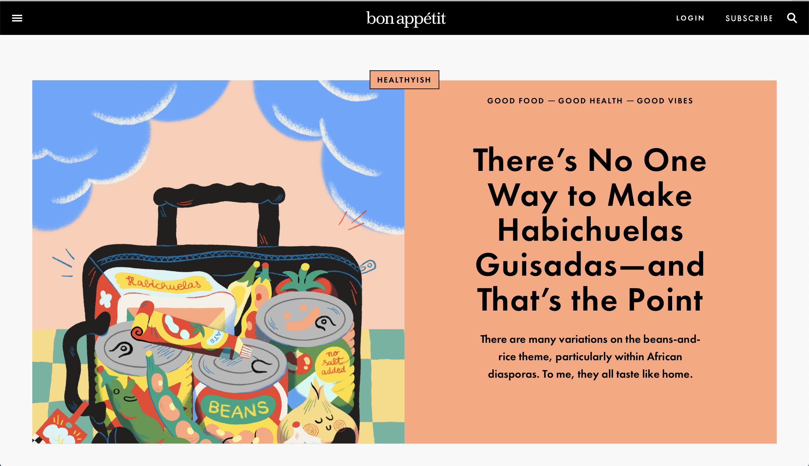 
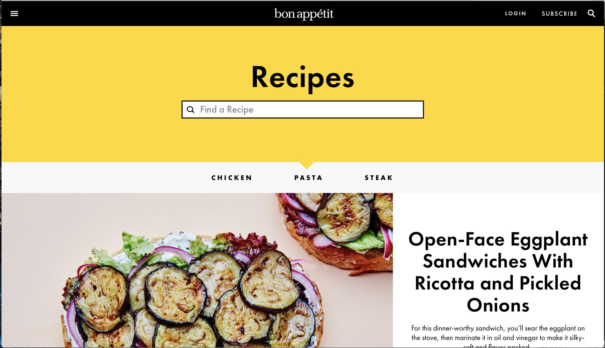 

**Breakdown-schets(en):**

